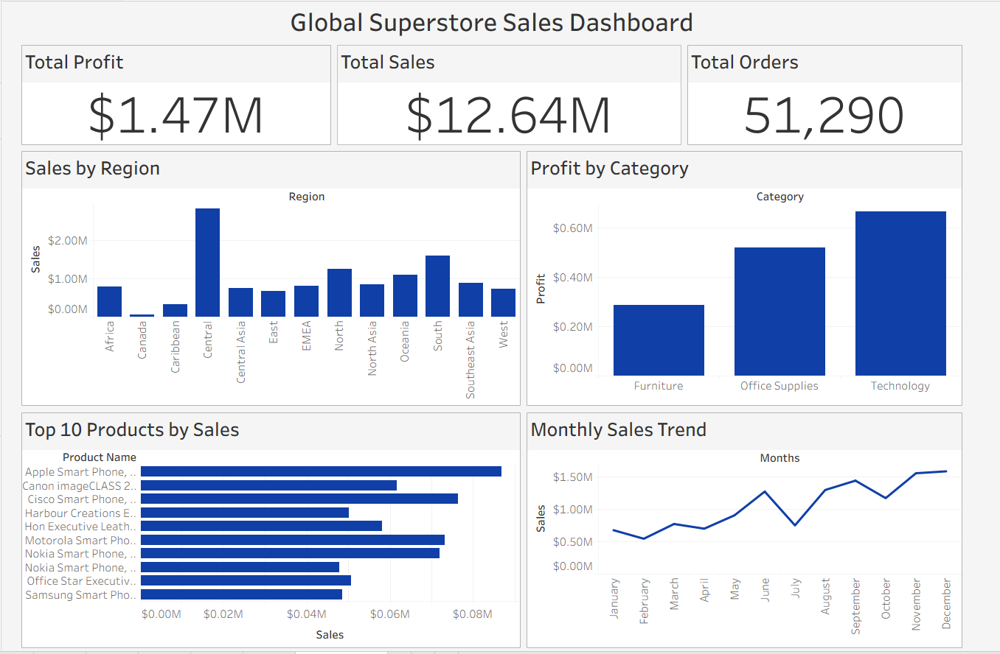

# 📊 Global Superstore Sales Analysis Dashboard

## 📌 Project Overview

This project presents a comprehensive **Sales Analysis Dashboard** built using Tableau.
The goal of this project is to analyze global sales performance, identify profitable product categories, and understand sales trends across different regions.

The dashboard provides interactive visualizations to help businesses make **data-driven decisions**.

---

## 🎯 Project Objectives

* Analyze overall sales and profit performance
* Identify top-performing products
* Evaluate sales distribution across regions
* Understand monthly sales trends
* Compare profit contribution by product category

---

## 🛠 Tools & Technologies Used

* **Tableau** – Data visualization and dashboard creation
* **Microsoft Excel** – Data storage and preprocessing
* **GitHub** – Project documentation and version control

---

## 📂 Dataset Information

The dataset used in this project is the **Global Superstore Dataset**, which contains information about:

* Orders
* Products
* Customers
* Regions
* Sales and Profit metrics

---

## 📊 Dashboard Features

### Key Performance Indicators (KPIs)

* Total Sales
* Total Profit
* Total Orders

### Visualizations Included

* **Sales by Region** – Bar chart showing regional performance
* **Profit by Category** – Category-wise profit comparison
* **Top 10 Products by Sales** – Best selling products
* **Monthly Sales Trend** – Sales performance throughout the year

---

## 🔍 Key Insights

* The **Central region** generates the highest sales revenue.
* The **Technology category** produces the highest profit.
* Certain products consistently generate high revenue across markets.
* Sales show noticeable growth during later months of the year.

---

## 📸 Dashboard Preview

---

## 📁 Project Files

* `Global_Superstore_Dashboard.twbx` – Tableau dashboard file
* `SuperStoreOrders.csv.xlsx` – Dataset used for analysis
* 'sales_analysis.py'– Python script used for data exploration and preprocessing

---

## 👨‍💻 Author

**Mudaragadda Sivasairam**
B.Tech – Computer Science Engineering
📍 Visakhapatnam, India
